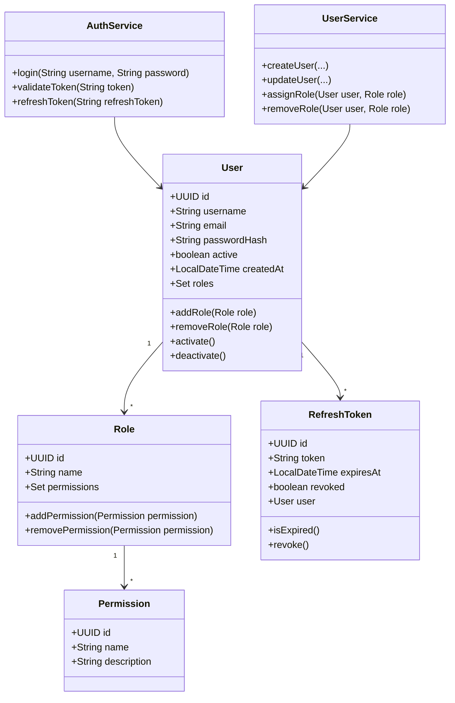

```mermaid
    classDiagram
    
    class User {
    +UUID id
    +String username
    +String email
    +String passwordHash
    +boolean active
    +LocalDateTime createdAt
    +Set<Role> roles
    +addRole(Role role)
    +removeRole(Role role)
    +activate()
    +deactivate()
    }
    
    class Role {
    +UUID id
    +String name
    +Set<Permission> permissions
    +addPermission(Permission permission)
    +removePermission(Permission permission)
    }
    
    class Permission {
    +UUID id
    +String name
    +String description
    }
    
    class RefreshToken {
    +UUID id
    +String token
    +LocalDateTime expiresAt
    +boolean revoked
    +User user
    +isExpired()
    +revoke()
    }
    
    class AuthService {
    +login(String username, String password)
    +validateToken(String token)
    +refreshToken(String refreshToken)
    }
    
    class UserService {
    +createUser(...)
    +updateUser(...)
    +assignRole(User user, Role role)
    +removeRole(User user, Role role)
    }
    
    User "1" --> "*" Role
    Role "1" --> "*" Permission
    User "1" --> "*" RefreshToken
    AuthService --> User
    UserService --> User
```
